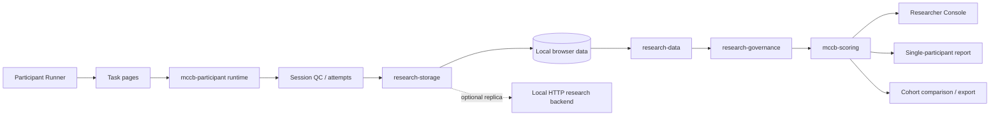
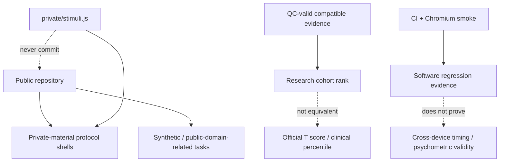

# Architecture

`psy-exp` is intentionally browser-first. The architecture separates task execution, research governance, local storage, optional replication, and researcher-facing interpretation.

## Trust and evidence boundaries

## Canonical control files

- `task-manifest.json` — task/runtime/material/scoring metadata.
- `protocol-lock.json` — protocol lock and governance state.
- `RESEARCH_VALIDATION.md` — what has and has not been validated.
- `docs/PROTOCOL_GOVERNANCE.md` — protocol change rules.
- `docs/RESEARCH_DATA_MODEL.md` — research data entities and versions.
- `docs/BACKEND_V1.md` — local-primary / optional HTTP-replica design.

## Runtime surfaces

- `index.html` — researcher console.
- `participant-runner.html` — participant flow and preflight.
- `pages/` — individual task implementations.
- `mccb-participant.js` — task runtime/session behavior.
- `mccb-scoring.js` — research-safe compatibility and ranking logic.
- `research-storage.js` / `research-data.js` / `research-governance.js` / `research-session.js` — research data pipeline.
- `research-report.html` / `research-comparison.html` — interpretation/export surfaces.
- `server/research-backend.cjs` — optional local HTTP replica.

## Validation boundary

The architecture is executable enough to be regression-tested, but software architecture evidence must not be converted into a psychometric-equivalence claim.
